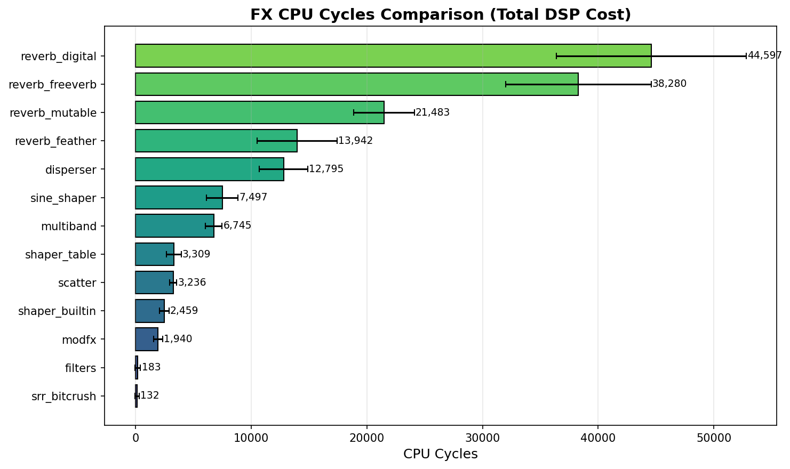
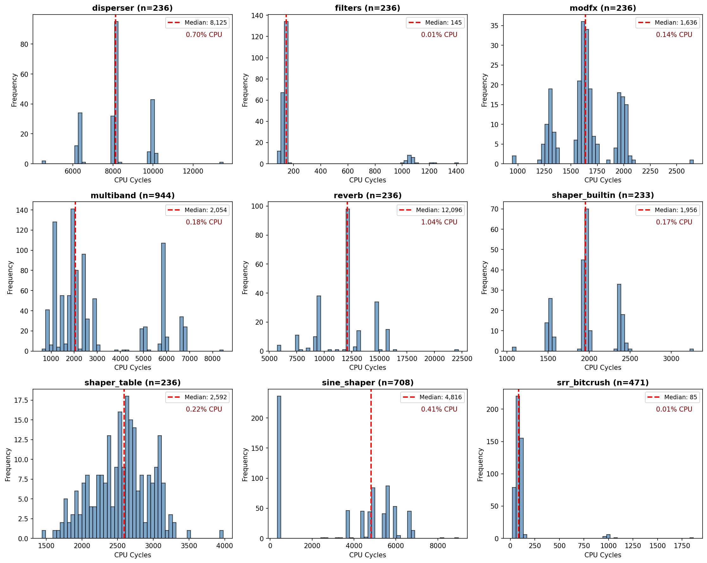

# Deluge Community Firmware

---

## Owlet Firmware

This is **owlet-firmware**, a personal fork of the Deluge Community Firmware maintained at [owlet-labs/DelugeFirmware](https://github.com/owlet-labs/DelugeFirmware). It serves as a playground for experimental sound design features that may be too specialized or CPU-intensive for the main community branch.

### Features (vs Community)

| Feature | Description |
|---------|-------------|
| **Multiband OTT Compressor** | 3-band upward/downward compressor with "Feel" modulation system. 8 vibe zones for dynamic character control. |
| **Sine Shaper** | Harmonic waveshaping with width, evolution, recursion, and feedback zones. |
| **Disperser** | Allpass filter cascade for frequency-dependent phase smearing. Twist zones with punch, curve, chirp, and Q-tilt. |
| **Table Shaper** | Wavetable-based waveshaping. |
| **Retrospective Sampler** | Lookback buffer for capturing audio after the fact. |
| **Zone Menu Items** | Horizontal menu UI component for zone-based parameters with visual feedback. |
| **FX Benchmarking Framework** | Performance profiling tools for DSP development. |

### Benchmarks

CPU usage per voice (optimization ongoing). Target: stay under 2x the builtin saturation (`getTanhAntialiased`) cost, except for disperser which is inherently more expensive.

### For Developers

This fork is open source under the same GPL-3.0 license as the community firmware. Feel free to:
- Fork this repo for your own experiments
- Cherry-pick individual features into your own builds
- Submit PRs to the main community repo if you refine something worth sharing

No guarantees of stability or compatibility. Use at your own risk.

---

## Dear Deluge owners
If you want to start using the community firmware please visit https://synthstromaudible.github.io/DelugeFirmware/ for all relevant details.

## About
The [Deluge](https://synthstrom.com/product/deluge/) from [Synthstrom Audible](https://synthstrom.com/) is a portable sequencer, synthesizer and sampler. Synthstrom Audible decided to [open source](https://synthstrom.com/open/) the firmware application that runs on the Deluge to allow the community to customize and extend the capabilities of the device. 

The hardware is built around a Renesas RZ/A1L processor with an Arm® Cortex®-A9 core running at 400MHz and 3MB of on-chip SRAM. Connected to that is a 64MB SDRAM chip, a PIC for button handling and either a 7-Segment array or an OLED screen. The application is written in C and C++ and some occasional assembly in bare metal style without an operating system.

## Important links
* For acquiring and using the firmware visit the [community firmware website](https://synthstromaudible.github.io/DelugeFirmware)
* Once you have the firmware, consult our detailed [update guide](https://github.com/SynthstromAudible/DelugeFirmware/wiki/Update-guide) for instructions on how to install it
* To contribute to the project with code, bug reports, suggestions, and feedback see: [How to contribute to Deluge Firmware](https://github.com/SynthstromAudible/DelugeFirmware/blob/community/docs/CONTRIBUTING.md)
* To learn about the toolchain, application, and to start working on the code continue with: [Getting Started with Deluge Development](https://delugecommunity.com/development/deluge/getting_started/)
* Please also visit the [Synthstrom Forum](https://forums.synthstrom.com/) and the community [Discord](https://discord.gg/BnRcyFSgaT) to interact with other users and the developers
* You can donate to the project using the [Synthstrom Patreon](https://www.patreon.com/Synthstrom)
