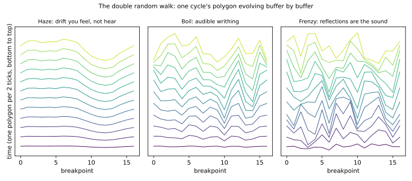
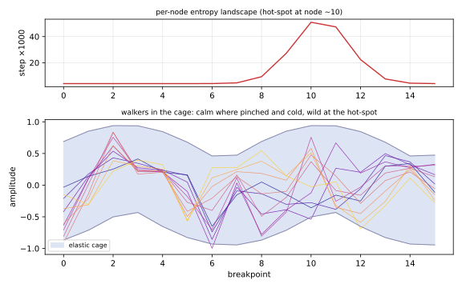
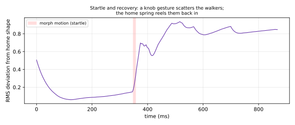

# PHI_GENDY: Dynamic Stochastic Synthesis — Design Notes

PHI_GENDY (`dsp/phi_gendy.{hpp,cpp}`, `OscType::PHI_GENDY`) is the fifth phi-family
oscillator: Iannis Xenakis's **dynamic stochastic synthesis**, the GENDYN lineage, with a
pitch lock and phi-triangle terrain. Where the siblings are geometry, physics, voice, and
synchronization, PHI_GENDY is *entropy* — a waveform that is a population of random
walkers in a cage.

## Literature

- Xenakis, I. **"Formalized Music: Thought and Mathematics in Composition."** Rev. ed.,
  Pendragon Press, 1992 (chs. 9, 13–14). — Dynamic stochastic synthesis and GENDY3:
  waveforms as stochastic processes, composed at the sample level.
- Serra, M.-H. **"Stochastic Composition and Stochastic Timbre: GENDY3 by Iannis
  Xenakis."** *Computer Music Journal* 17(1), 1993. — The definitive technical analysis.
- Hoffmann, P. **"The New GENDYN Program."** *Computer Music Journal* 24(2), 2000. — The
  reconstruction whose algorithm this implementation follows — including duration walks,
  which here renormalize total cycle length each tick so pitch stays locked while the
  harmonic skeleton lurches.
- Luque, S. **"The Stochastic Synthesis of Iannis Xenakis."** *Leonardo Music Journal*
  19, 2009. — Historical and musical context.

## The kernel

The waveform is a 16-breakpoint polygon. Once per audio buffer, every breakpoint
amplitude takes one step of GENDYN's **double random walk** — the velocity walks, the
position follows, so drift has momentum — and reflects off **elastic barriers**:

```
v[i] += step[i]*rand + startle*rand ;  v clamped to ±velCap
a[i] += v[i] + homePull*(home[i] - a[i])
reflect a[i] off [barrierLo[i], barrierHi[i]], bleeding momentum
```

Segment **widths** walk too (the duration-walk half of GENDYN), between their own
elastic barriers — but the widths renormalize to a constant cycle length each tick, so
**pitch stays locked** while the harmonic skeleton itself lurches. (Xenakis let total
duration wander, which is glorious in a concert hall and unusable on a groovebox.) The
variable-width polygon is resampled onto a uniform 64-slot scan table at tick time, so
the render remains the same branch-free lerp as PHI_WEAVE. Amplitude-only walks tilt the
spectrum over a static frame — the source of the v1 "vagueness"; width walks move the
frame.



The entropy knob is the step size, ranged exponentially (0.0015..0.27): at the bottom the
drift is slower than perception and the polygon reads as a warm, slightly-alive static
wave; at the top the walkers slam the barriers every tick and the reflections themselves
are the sound — the Xenakis grit.

## Phi terrain: landscapes over the polygon

The classic algorithm applies one step size and one cage to all breakpoints. Here,
step sizes, barrier widths, and barrier *centers* (asymmetric cages skew the polygon) are
painted per node by phi-triangle spatial landscapes — so one region of the cycle boils
while another stays calm, and every zone position paints different terrain:



A gentle spring toward a zone-defined **home polygon** (low phi partials) gives calm
zones a timbre to relax into; the pull fades as entropy rises, so frenzied zones are pure
walk.

## The morph startles

Morph interpolates the **walk laws** — step, cage, home — never the walker state, so
crossfading is click-free by construction (PHI_WEAVE's principle). Crossfade *motion*
kicks velocity noise into all sixteen walkers — a startle — and the home spring reels
them back in. Note-on startles too (the shared-state sibling of WEAVE's pluck):



## Zones

Haze, Murmur, Wander, Ripple, Boil, Writhe, Snarl, Frenzy — the exponential entropy arc,
with barrier and landscape character varying independently along the way.

## Cost

PHI_MORPH-class: the scan is 16-node WEAVE's skeleton; the walk is 16 breakpoints of
float math once per buffer. State: one shared polygon per Sound (~600 bytes including
both banks), zero per-voice state.

## Figures

```
python3 docs/dev/generate_phi_gendy_figures.py
```
