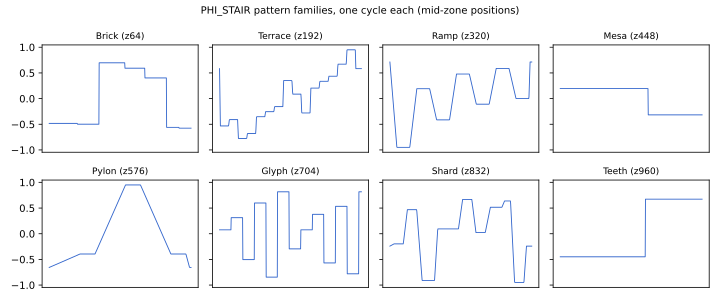
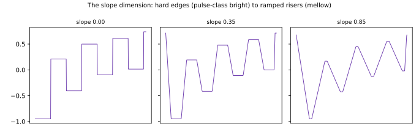
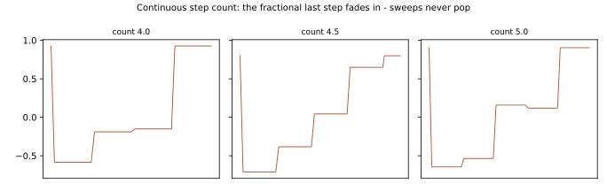

# PHI_STAIR: Staircase Wavetable — Design Notes

PHI_STAIR (`dsp/phi_stair.{hpp,cpp}`, `OscType::PHI_STAIR`) is the sixth phi-family
oscillator and its digital primitive: the waveform is a **staircase** of up to 16 steps
with zone-derived heights, widths, and riser slope. Where the siblings are geometry,
physics, voice, synchronization, and entropy, PHI_STAIR is *quantization as timbre*.

## Lineage

Stepped-waveform synthesis has a real 1970s pedigree: **Walsh-function synthesis** built
timbres from piecewise-constant rectangular basis functions as a hardware-friendly
alternative to Fourier synthesis — see Hutchins's *Electronotes* treatments and the
summary in Chamberlin, **"Musical Applications of Microprocessors"** (Hayden, 1980).
PHI_STAIR is a φ-flavored descendant in spirit: not Walsh-orthogonal, but the same
conviction that flat levels and hard edges are a musical basis, not a defect.

## The waveform



Zone selects a **height pattern family** — Brick (square-class alternation), Terrace
(saw-stair climb), Ramp (smooth-biased), Mesa (up-plateau-down), Pylon (tall center),
Glyph (φ-random quantized levels — the bitcrush-adjacent one), Shard (asymmetric jumps),
Teeth (leaning pair alternation) — each wandered by φ-triangle landscapes plus a tilt
dimension. Widths carry the **asymmetry** (a spatial landscape, renormalized so pitch is
exact).

**Slope** sweeps the risers from hard edges to fully ramped:



Hard steps give pulse-class (−6 dB/oct) brightness; full slope approaches a polygon. The
mapping is squared so most of the map stays steppy; the Ramp family biases smooth.

**Step count is continuous** (2..16): the last step's width fades in fractionally, so
zone sweeps and morphs never pop a step in or out — the lesson learned from VOX's
integer-pulse-count discontinuity, applied from birth:



## Architecture (assembled from proven family parts)

- 128-slot scan table rebuilt only when the morph moves (epsilon-guarded, so a parked
  wave knob costs nothing); each rebuild crossfades previous → current over one buffer
  with a forward-differenced smoothstep (the de-zipper).
- WEAVE's pitch-adaptive anti-alias mips (binomial passes, ~700/1800 Hz thresholds) and
  dual-tap stereo zones (tilt reads a darker mip; counter mirrors the right tap).
- Halved-difference lerps throughout — steps sign-flip at full scale *by design*, which
  is exactly the q31-difference overflow trigger fixed family-wide.
- Static square-calibrated loudness: each rebuilt table is normalized to saw-class RMS
  with a peak cap at square parity (sparse patterns like Glyph would otherwise be much
  quieter than dense ones).
- Zero per-voice state; everything is table + scan.

## Figures

```
python3 docs/dev/generate_phi_stair_figures.py
```
