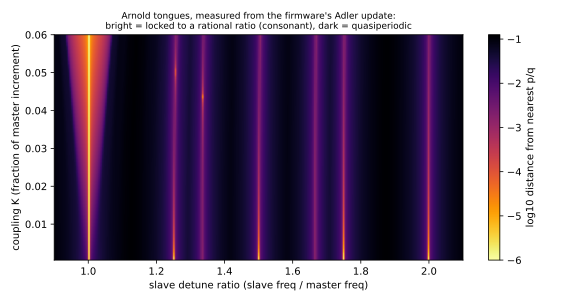
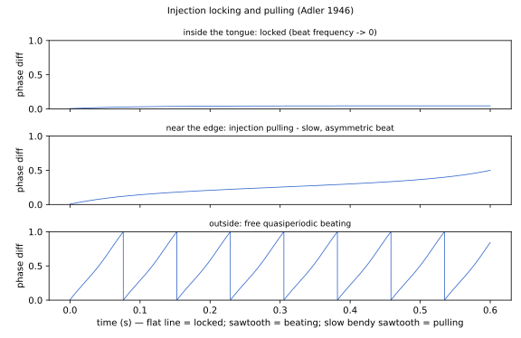
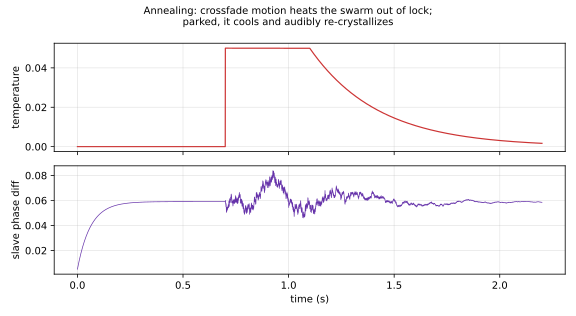

# PHI_SWARM: Synchronization Oscillator — Design & Physics

PHI_SWARM (`dsp/phi_swarm.{hpp,cpp}`, `OscType::PHI_SWARM`) is the fourth phi-family
oscillator, built on the physics of **oscillators that entrain each other** — injection
locking, Arnold tongues, and the Kuramoto transition. Where [PHI_MORPH](phi-triangle.md)
is geometry, [PHI_WEAVE](phi-weave-physics.md) is physics-in-motion, and
[PHI_VOX](phi-vox-vosim.md) is voice, PHI_SWARM is *relationship*: its sound is the
behavior between oscillators, not the oscillators themselves.

## Literature

- Adler, R. **"A Study of Locking Phenomena in Oscillators."** *Proc. IRE* 34(6), 1946
  (reprinted *Proc. IEEE* 61(10), 1973). — The founding equation of injection locking.
- Kuramoto, Y. **"Self-entrainment of a population of coupled non-linear oscillators."**
  *Lecture Notes in Physics* 39, Springer, 1975. — Populations of coupled phases;
  fireflies flashing in sync.
- Strogatz, S. **"From Kuramoto to Crawford."** *Physica D* 143, 2000. — The review.
- Bak, P. **"The Devil's Staircase."** *Physics Today* 39(12), 1986. — Mode locking and
  Arnold tongues as a universal structure.
- Essl, G. **"Circle Maps as Simple Oscillators for Complex Behavior."** *Proc. ICMC*,
  2006. — Circle-map dynamics proposed for audio synthesis.

## The kernel

A master phase (the note, pitch-exact) drives two slaves through per-sample Adler
coupling:

```
s_i += w_i + K_im*sin(theta_m - s_i) [+ K_12*sin(s_1 - s_2)] + T*noise
out  = w1*sin(s1) + w2*sin(s2) + wr*sin(s1)*sin(s2)
```

Couplings and temperature scale with the master increment, so the locking behavior is
pitch-invariant. The coupling forces use a 4-op parabolic sine (their waveshape is
inaudible); only the two output sines use the interpolated table. Per-voice state is two
phase words, packed into a `uint64` that only TRIANGLE_PW otherwise uses — zero struct
growth.

## The parameter space is Arnold tongues

This figure is *measured from the firmware's own update rule* — winding number of the
driven slave across the detune/coupling plane:



Inside a tongue, the slave locks to an exact rational ratio of the note **even though it
is detuned** — the coupling supplies the missing frequency. That is self-tuning
consonance: zones park ratios *near* tongues and the phi wander walks them across the
boundary, so adjacent zone positions sit on opposite sides of a lock.

## Injection pulling

Near a tongue edge the slave cannot quite lock: the beat note survives but becomes slow
and asymmetric — it *hesitates* near the locked phase and snaps through the rest of the
cycle. Adler derived this in 1946 for misbehaving radio receivers; it is a gorgeous
sound:



## Temperature and annealing

`T` adds Langevin phase noise: zero is crystalline, small is analog drift, large melts
the network into colored noise. The morph gesture (fourth incarnation of the family
principle) is **annealing**: crossfade motion injects heat, and when the knob parks, the
heat decays (~0.85 per buffer) and the slaves audibly re-crystallize into zone B's locks:



## Zones

Still, Drift, Pull, Swarm, Flock, Surge, Fray, Chaos — anchors tracing the path from
pure locked intervals (Still: 1:1 + 2:1, strong K, T=0) through beating, pulling,
quasiperiodic phi-ratio shimmer, slave-chasing (Flock: K12 dominant), to overshoot chaos
(Chaos: K far beyond the stability edge plus high T). Anchor tables in `phi_swarm.cpp`;
phi-triangle wander in `phi_swarm.hpp`.

## Figures

```
python3 docs/dev/generate_phi_swarm_figures.py
```
