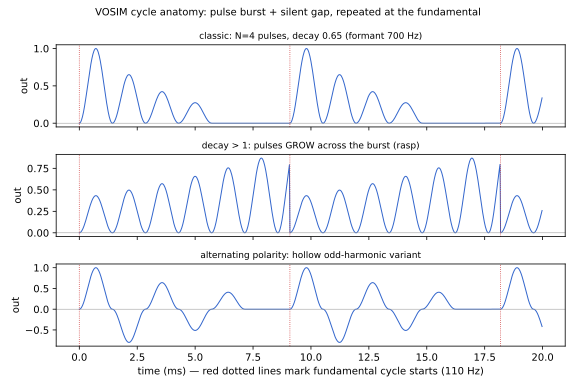
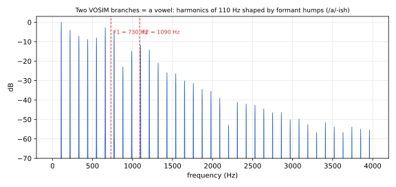
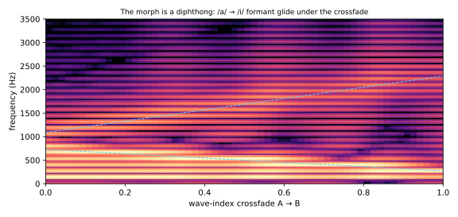

# PHI_VOX: VOSIM Voice Oscillator — Design Notes

PHI_VOX (`dsp/phi_vox.{hpp,cpp}`, `OscType::PHI_VOX`) is the third phi-family oscillator,
built on **VOSIM** — *VOice SIMulation* — developed by Werner Kaegi and Stan Tempelaars at
the Institute of Sonology, Utrecht, in the 1970s. Where [PHI_MORPH](phi-triangle.md) is
geometry and [PHI_WEAVE](phi-weave-physics.md) is physics, PHI_VOX is *voice*.

## Literature

- Kaegi, W., and Tempelaars, S. **"VOSIM—A New Sound Synthesis System."** *Journal of the
  Audio Engineering Society* 26(6), pp. 418–425, 1978. — The founding paper: convincing
  vowels from pulse trains simple enough for 1970s dedicated hardware.
- Rodet, X. **"Time-Domain Formant-Wave-Function Synthesis."** *Computer Music Journal*
  8(3), 1984. — The related FOF lineage (IRCAM's CHANT vocal synthesizer); FOF generalizes
  the same idea with per-formant granules.

## The kernel

Each fundamental cycle emits, per formant branch, a burst of **N raised-cosine pulses** at
the formant rate, successive pulses scaled by a decay factor *b*, followed by silence until
the cycle wraps:



The pulse rate sets the formant's **center frequency**; N and b set its **bandwidth**
(longer ring = narrower formant). sin²(πt) over one formant period is exactly a raised
cosine, `(1 − cos 2πφ)/2` — one table read, no squaring. Because the pulses start and end
at zero, the spectrum rolls off smoothly: gentle aliasing behavior with no band-limiting
machinery.

Two branches make a vowel:



Formant frequencies are fixed in **Hz** (not pitch ratios), so vocal identity survives
transposition the way a real vocal tract does — the same reason a singer's /a/ stays an
/a/ across their range.

## Statelessness

The output is a **pure function of cycle phase**: samples-into-cycle comes from one divide
at buffer start, then one 64-bit multiply yields both the pulse index (high word) and the
formant phase (low word); within the buffer both advance by adds and carries. There is
**no per-voice state whatsoever** — retrigger phase, oscillator sync, and unison all
compose for free, and the entire oscillator is two ~130-byte parameter banks per Sound.
Estimated ~12–14 cycles/sample, between PHI_MORPH and the stock wavetable.

DC (the classic VOSIM pitfall — the pulses are unipolar) is removed structurally: the
burst's mean, scaled by the pitch-dependent duty factor, is subtracted per buffer.

## Zone → voice via φ-triangles

Zone positions interpolate across eight **vowel formant anchors** (Breath, Hum, Round,
Open, Bright, Nasal, Growl, Rasp — from /i/-breathy through /u/, /o/, /a/, /e/ to
harsh-spread) and the [phi-triangle banks](phi-triangle.md) wander F1 ±0.6 and F2 ±0.8
octaves around them, along with pulse counts, decay, polarity, balance, and breath. Per
the design direction ("unique over believable"), the wander deliberately exceeds vocal
physiology: decay > 1 **grows** the pulses across the burst (brass rasp), alternating pulse
polarity produces hollow odd-harmonic variants, and F2 reaches alien territory. The
anchors keep everything *voiced*; the φ-wander keeps it strange.

## The morph is a diphthong

The A/B crossfade interpolates formant frequencies and burst tables — a formant glide,
which is precisely what a diphthong is:



And the crossfade's **motion** injects a noise burst into the pulse envelope
(voiced-gated, so it articulates rather than hisses): a consonant. Sweeping the wave
index makes the oscillator *speak*; an LFO on it babbles. This is the third incarnation
of the phi-family's morph-as-gesture principle (PHI_MORPH: virtual intermediate frames;
PHI_WEAVE: morph-bow; PHI_VOX: articulation).

## Figures

Generated by [`generate_phi_vox_figures.py`](generate_phi_vox_figures.py) (firmware-
equivalent synthesis in NumPy):

```
python3 docs/dev/generate_phi_vox_figures.py
```
