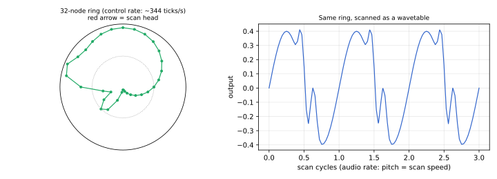
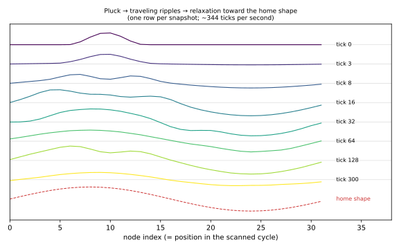
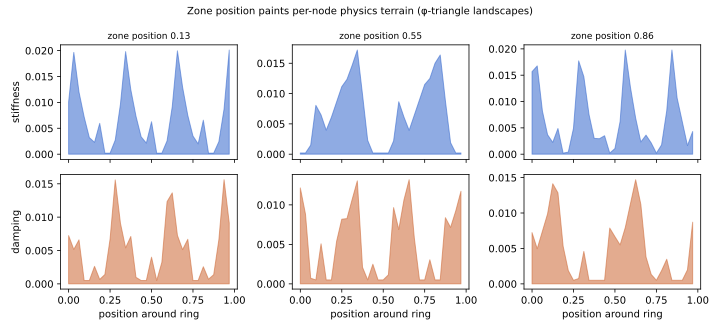
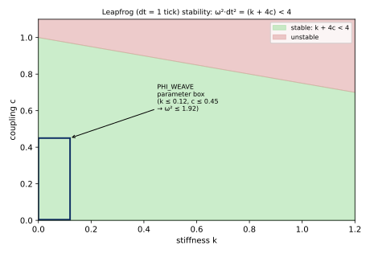
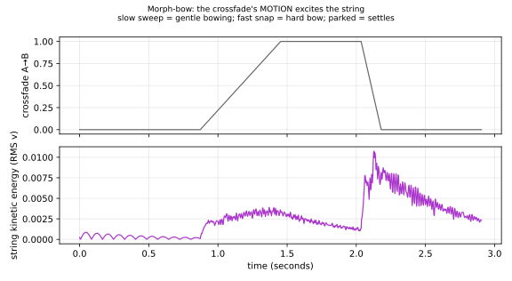

# PHI_WEAVE: Scanned-Physics Oscillator — Design & Physics

PHI_WEAVE (`dsp/phi_weave.{hpp,cpp}`, `OscType::PHI_WEAVE`) is an oscillator built on
**scanned synthesis**, the last synthesis paradigm proposed by Max Mathews, with Bill
Verplank and Rob Shaw, around 1999–2000. It is the sibling of [PHI_MORPH](phi-triangle.md):
the same zone/φ-triangle exploratory interface, but where PHI_MORPH's zone position selects
frozen waveform *geometry*, PHI_WEAVE's selects the *laws of motion* of a living dynamical
system.

## Literature

- Verplank, B., Mathews, M., and Shaw, R. **"Scanned Synthesis."** *Proceedings of the
  International Computer Music Conference (ICMC)*, Berlin, 2000. — The founding paper:
  a slow dynamical system ("a wave shape evolving at haptic rates") scanned at audio rate.
- Boulanger, R., Smaragdis, P., and ffitch, J. **"Scanned Synthesis: An Introduction and
  Demonstration of a New Synthesis and Signal Processing Technique."** *Proceedings of the
  ICMC*, Berlin, 2000. — Companion paper; basis of the Csound reference implementation
  (`scanu`/`scans` opcodes).
- Verlet, L. **"Computer 'Experiments' on Classical Fluids. I."** *Physical Review* 159(1),
  98–103, 1967. — The symplectic integration scheme (leapfrog/Verlet) used for the ring.

Prior art in hardware is nearly nonexistent (the Qu-Bit *Scanned* Eurorack module, 2019, is
the notable exception), which is precisely why it's here.

## The core idea: two clocks

Mathews' insight: human timbre perception cares about spectral evolution on the **haptic**
timescale (1–100 Hz), while pitch lives on the **audio** timescale (20 Hz–20 kHz). So run a
physical simulation slowly — where it's cheap and controllable — and extract audio from it
by *scanning* its instantaneous shape as a wavetable:



- **Control clock:** the mass-spring ring is integrated once per render buffer
  (~344 Hz at 128-sample buffers). 32 nodes × ~10 float ops = statistically free.
- **Audio clock:** each sample reads the ring at the scan phase (power-of-two node count:
  `index = phase >> 27`, one branch-free lerp, ~6 ops/sample — cheaper than PHI_MORPH's
  segment walk).

Pitch and timbre evolution are thereby **decoupled**: a bass note and a high note scanning
the same ring have identical timbre trajectories.

## The model

Departing from Mathews' terminated string, PHI_WEAVE uses a **closed ring** of N=32 nodes.
The scanned cycle is then periodic *by topology* — no wavetable seam exists to click, ever.
Each node i carries position `x[i]`, velocity `v[i]`, and per-node parameters:

```
a[i] = c[i]·(x[i-1] + x[i+1] - 2·x[i])   // neighbor tension → traveling waves
     - k[i]·(x[i] - h[i])                // spring toward the home shape h
     - d[i]·v[i]                         // damping
     + F_bow[i] + F_morph[i]             // excitation
v[i] += a[i] ;  x[i] += v[i]             // leapfrog, dt = 1 tick
```

The **home shape** `h[i]` (a φ-weighted mix of partials 1, 2, 3, 5) is the string's rest
pose: with no excitation the ring relaxes to it, so every zone has a *baseline timbre* it
breathes around, rather than decaying to silence:



## Zone → physics via φ-triangles

All parameters come from [phi-triangle banks](phi-triangle.md) evaluated at
`zone/1023 + gamma`. The spatial profiles are triangles evaluated *around the ring* with
zone-dependent phase — each of the 1024 zone positions paints different physical terrain
(stiff bright regions vs slack dark ones, ringing vs dead spots, all within one cycle):



Scalars (bow rate/depth/position, ring travel, pluck shape, morph-bow gain, output trim)
come from the same quasi-periodic machinery, so no two zone positions behave alike and the
space never repeats.

## Stability

Leapfrog on the stiffest mode of the ring Laplacian requires `ω²·dt² = (k + 4c) < 4`. The
firmware clamps `k ≤ 0.12` and `c ≤ 0.45`, keeping the worst case at 1.92 — inside the
stable region with a 2× margin — plus velocity/displacement clamps whose failure mode is
saturation ("overdriven string"), not blowup:



## The morph is an excitation

There is **one** string state per Sound, shared by all voices and unison parts (256 bytes).
The A/B crossfade interpolates the *parameters* under that continuous state — morphing
cannot click by construction, because nothing discontinuous ever happens to `x` or `v`.

Better: the crossfade's **motion** injects energy (`morph-bow`), scaled by zone B's φ-bank.
Turning the wave-index knob physically bows the string; automating it is a bowing gesture;
parking it lets the sound settle into the new laws:



Note-on adds a raised-cosine **pluck** (zone-dependent position/width), so playing keeps
the shared string agitated and the sound *remembers* what you just did to it.

## Loudness

A slow AGC (instant attack, ~1.5 s release) tracks peak displacement and normalizes output,
so near-static heavily-damped zones and boiling agitated ones land at comparable loudness —
the same role PHI_MORPH's energy normalization plays.

## Figures

All figures are generated by [`generate_phi_weave_figures.py`](generate_phi_weave_figures.py),
which simulates the identical physics in NumPy. Regenerate with:

```
python3 docs/dev/generate_phi_weave_figures.py
```
