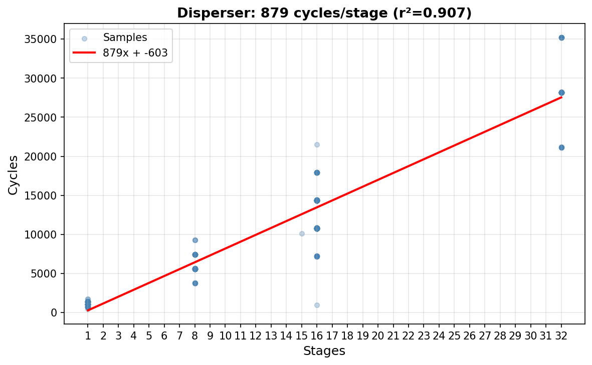

# Disperser Zone-Based Enhancement Design

## Overview

The disperser effect uses 16 cascaded first-order allpass filters for phase smearing. Currently it exposes only basic parameters (freq, spread, feedback, stages). This document explores adding zone-based "Topo" and "Twist" knobs following the pattern established by sine shaper.

## Current Architecture

### DSP Path
```
input → [feedback mixing] → [allpass cascade ×N] → [DC blocker] → output
                ↑                                        ↓
                └────────────── feedback ────────────────┘
```

### Parameters
| Param | Range | Function |
|-------|-------|----------|
| Frequency | 50Hz-8kHz | Center frequency for allpass coefficients |
| Spread | 0-127 | Coefficient spread across stages (0=same, 127=±4 octaves) |
| Feedback | ±90% | Output→input recirculation with DC blocker |
| Stages | 0-16 | Active allpass stages |

### Benchmark Data (2025-01)

```
Disperser Cycles by Stage Count:
==================================================
Stage   Median    CPU%     n
  1       880    0.076%   44
  2     1,121    0.097%   50
  4     1,566    0.135%   34
  8     2,472    0.213%   32
 12     3,396    0.292%   32
 16     4,301    0.370%   33

Linear fit: ~228 cycles/stage + 650 base
```



At 16 stages, the disperser costs ~0.37% CPU per sound.

## Zone Knob Architecture

Following sine shaper's pattern:
- **Topo (Topology)**: Selects discrete signal routing (like Harmonic selects algorithm)
- **Twist**: Modifies character within any topology (like Twist adds Width/Evens/Rect/Feedback)

### Key Design Principle: Discrete Topologies

Unlike sine shaper where algorithms can blend (they're all polynomial operations), disperser topologies are **structurally different signal routings**:
- Cascade: L→stage1→stage2→...→stageN
- Ping-Pong: alternating L/R per stage
- Cross-Coupled: L↔R feedback mixing

**You cannot smoothly interpolate between topologies.** Zone boundaries will have discontinuities if crossed. Therefore:
- Topo zones are discrete (no cross-zone modulation)
- Position within zone controls continuous params FOR that topology
- Twist does NOT modulate Topo zone selection

## Parameter Evolution via Irrational Triangles

Within each topology zone, **multiple parameters evolve** using triangle waves with irrational frequency ratios (φ-powers). This creates complex, non-repeating modulation.

### Triangle Phase Modulation

```cpp
// φ-power frequencies (never align, quasi-periodic)
constexpr float kPhi025 = 1.1271566f;  // φ^0.25
constexpr float kPhi050 = 1.2720196f;  // φ^0.5
constexpr float kPhi075 = 1.4352958f;  // φ^0.75
constexpr float kPhi100 = 1.6180340f;  // φ^1.0

float pos = getPosInZone();  // 0→1 within current zone
float ph = metaPhaseTopo;    // Secret knob offset

// Multiple params, each with irrational frequency
float param1 = triangleUnipolar(pos * kPhi025 + ph * kPhi025, 0.8f);
float param2 = triangleUnipolar(pos * kPhi050 + ph * kPhi050, 0.7f);
float param3 = triangleUnipolar(pos * kPhi075 + ph * kPhi075, 0.6f);
```

### Frequency Modulation of Triangles

The triangle frequencies themselves are modulated by position and phase, creating acceleration/deceleration effects:

```cpp
// Per-param frequency multiplier: ramps 1.0→(1.25-1.5)
// Peak value varies with phase offset
float fm1 = 1.0f + pos * (0.25f + 0.25f * phPhi025);
float fm2 = 1.0f + pos * (0.25f + 0.25f * phPhi050);

// Triangles with position-dependent speedup
float param1 = triangleUnipolar(pos * kPhi025 * fm1 + phPhi025 + offset1, 0.8f);
float param2 = triangleUnipolar(pos * kPhi050 * fm2 + phPhi050 + offset2, 0.7f);
```

**Effect:**
- At pos=0: triangles run at base rate
- At pos=1: triangles run 25-50% faster
- `metaPhaseTopo` shifts WHERE in this acceleration curve you are
- Creates beating, interference, quasi-periodic patterns
- Like FM synthesis applied to parameter space

## Secret Knob System

Following sine shaper's pattern, three phase offsets accessible via push+twist on encoders:

```cpp
struct DisperserParams {
    ZoneBasedParam<8, true> topo;     // Topology (clips to zone boundaries)
    ZoneBasedParam<8, false> twist;   // Character (allows cross-zone)

    // Secret knobs (unbounded, wrap in DSP)
    float metaPhaseTopo{0};   // Push Topo encoder → offsets topology params
    float metaPhase{0};       // Push Twist encoder → offsets character triangles
    float gammaPhase{0};      // Push Feedback encoder → coarse offset (100×)
};
```

| Param | Access | Effect | Scope |
|-------|--------|--------|-------|
| `metaPhaseTopo` | Push Topo | Offsets all triangle phases within topology | Current topo zone |
| `metaPhase` | Push Twist | Offsets character modifier triangles | Twist Meta zone |
| `gammaPhase` | Push Feedback | Adds `100*gamma` to metaPhase | Twist Meta zone |

**UI Pattern:**
```cpp
void selectEncoderAction(int32_t offset) override {
    if (Buttons::isButtonPressed(hid::button::SELECT_ENC)) {
        // Push+twist = secret menu
        float& phase = params.metaPhaseTopo;
        phase += velocity_.getScaledOffset(offset) * 0.1f;  // Unbounded
        display->displayPopup(intToString(phase * 10.0f));
    }
    else {
        ZoneBasedPatchedParam::selectEncoderAction(offset);
    }
}
```

## Proposed Topology Zones

Each topology has 2-4 parameters controlled by triangle-phased evolution.

| Zone | Name | Params via triangles | Extra Cost |
|------|------|----------------------|------------|
| 0 | **Cascade** | spread curve, resonance peak | 0 |
| 1 | **Ping-Pong** | alternation depth, L/R phase offset, freq split | ~0 |
| 2 | **Stereo Spread** | L/R freq offset, width, modulation rate | ~10 cycles |
| 3 | **Cross-Coupled** | cross amount, asymmetry (L→R vs R→L), damping | ~10 cycles |
| 4 | **Pitch Track** | tracking tightness, harmonic blend, octave shift | ~20 cycles |
| 5 | **Nested** | nesting depth, inner/outer balance | ~15 cycles |
| 6 | **Diffuse** | randomness, correlation, drift rate | ~15 cycles |
| 7 | **Spring** | chirp character, decay, density | ~20 cycles |

### Example: Ping-Pong Zone Implementation

```cpp
void computePingPongParams(float pos, float metaPhaseTopo, PingPongParams& out) {
    // Wrap phase per-frequency for precision
    auto wrapPh = [](float ph, float freq) {
        float scaled = ph * freq;
        return scaled - std::floor(scaled);
    };
    float ph025 = wrapPh(metaPhaseTopo, kPhi025);
    float ph050 = wrapPh(metaPhaseTopo, kPhi050);
    float ph075 = wrapPh(metaPhaseTopo, kPhi075);

    // Frequency modulation (speedup as pos increases)
    float fm = 1.0f + pos * (0.25f + 0.25f * ph025);

    // Three params with irrational frequencies
    out.alternationDepth = triangleUnipolar(pos * kPhi025 * fm + ph025 + 0.1f, 0.8f);
    out.lrPhaseOffset = triangleUnipolar(pos * kPhi050 * fm + ph050 + 0.3f, 0.7f);
    out.freqSplit = triangleUnipolar(pos * kPhi075 * fm + ph075 + 0.6f, 0.6f);
}
```

## Proposed Twist (Character) Zones

Twist modifies character ON TOP of whatever topology is selected.

| Zone | Name | Effect | Params |
|------|------|--------|--------|
| 0 | **Width** | Stereo spread | spread amount, modulation rate |
| 1 | **Warmth** | Feedback saturation | saturation amount, curve |
| 2 | **Drift** | Coefficient modulation | depth, rate, correlation |
| 3 | **Resonance** | Feedback boost | amount, frequency focus |
| 4-7 | **Meta** | All effects combined | φ-triangle evolution of all above |

### Twist Meta Zone

Like sine shaper, Twist zones 4+ combine all character effects with φ-ratio triangles:

```cpp
if (smoothedTwist >= kZone4) {
    // Meta zone: all effects active with irrational modulation
    float pos = (smoothedTwist - kZone4) / (ONE_Q31 - kZone4);
    double phRaw = metaPhase + 100.0 * gammaPhase;

    // Each effect gets its own frequency multiplier
    float fmW = 1.0f + pos * (0.25f + 0.25f * wrapPh(phRaw, kPhi025));
    float fmS = 1.0f + pos * (0.25f + 0.25f * wrapPh(phRaw, kPhi050));

    result.width = triangleUnipolar(pos * kPhi025 * fmW + phPhi025, 0.8f);
    result.warmth = triangleUnipolar(pos * kPhi050 * fmS + phPhi050, 0.7f);
    result.drift = triangleUnipolar(pos * kPhi075 * fmD + phPhi075, 0.6f);
    // etc.
}
```

## Pitch Tracking

### Available Data at Sound Level

```cpp
// In sound.h - already exists
int32_t lastNoteCode;  // Most recent note (semitones × 256)

// Conversion
float hz = 440.0f * std::pow(2.0f, (noteCode / 256.0f - 69.0f) / 12.0f);
```

### Pitch Track Topology

When in Pitch Track zone, stage frequencies are derived from `lastNoteCode`:
- Stage 0: fundamental
- Stage 1-N: harmonics or musical intervals
- Triangle params control: tracking tightness, harmonic series blend, octave shift

**Clip-level limitation:** Clips don't have `lastNoteCode`. Options:
- Reference pitch parameter (user sets root note)
- Skip pitch tracking for clips (fall back to manual freq)

## Implementation Phases

### Phase 1: Infrastructure
1. Add `DisperserParams` struct with zone params and secret knobs
2. Add patched params `LOCAL_DISPERSER_TOPO`, `LOCAL_DISPERSER_TWIST`
3. Wire up menu items with push+twist secret menus
4. Pass params to `processBuffer()`

### Phase 2: Topology Framework
1. Add topology dispatch in process loop
2. Implement Cascade zone (current behavior, add triangle evolution)
3. Implement Ping-Pong zone (L/R alternation with triangle params)
4. Implement Stereo Spread zone (dual coefficient arrays)

### Phase 3: Character Modifiers
1. Implement Width effect (L/R freq offset)
2. Implement Warmth effect (feedback saturation)
3. Implement Drift effect (per-stage LFO)
4. Implement Meta zone (combined with φ-triangles)

### Phase 4: Advanced Topologies
1. Implement Cross-Coupled (L↔R feedback)
2. Implement Pitch Track (using `lastNoteCode`)
3. Implement Nested (Schroeder-style)
4. Implement Spring (chirp character)

## Files to Modify

| File | Changes |
|------|---------|
| `dsp/disperser.h` | Add zone processing, topology dispatch, triangle helpers |
| `model/mod_controllable/mod_controllable_audio.h` | Add DisperserParams struct |
| `definitions.h` | Add `LOCAL_DISPERSER_TOPO`, `LOCAL_DISPERSER_TWIST` |
| `gui/menu_item/fx/disperser.h` | Zone-based menus with secret knob handling |
| `processing/sound/sound.cpp` | Pass pitch to processDisperser |

## References

- [Sine Shaper Implementation](../sine_shaper_chebyshev.md)
- [Zone-Based Parameter System](../../../../src/deluge/dsp/zone_param.hpp)
- [FX Benchmarking](../../fx_benchmarking.md)
